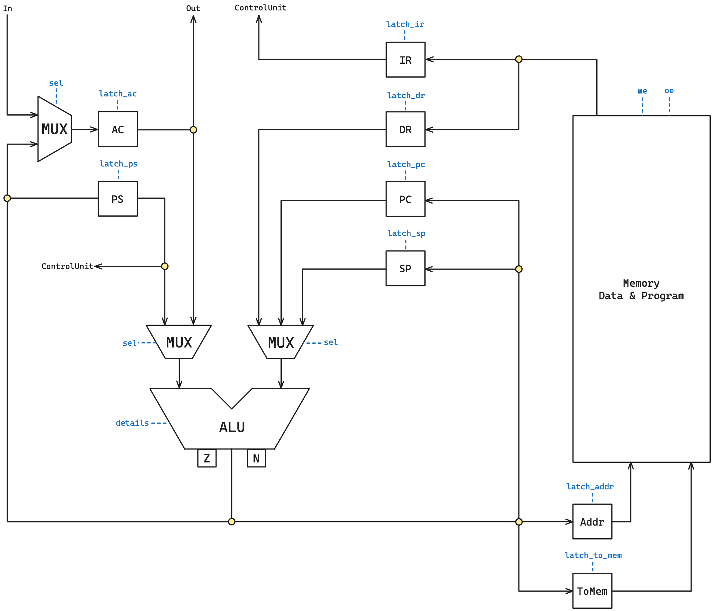
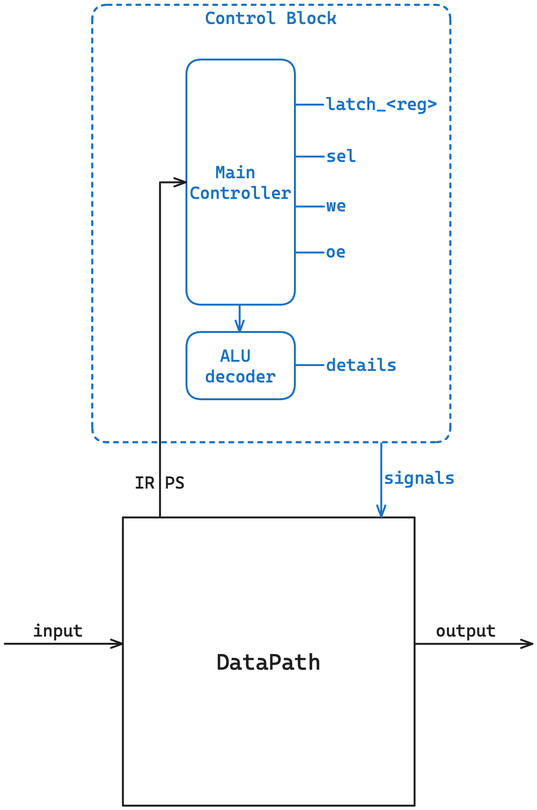

# Игрушечный процессор

## Детали выполненной работы

### Автор

 > Деревягин Егор Андреевич, P3215

### Вариант

 > asm | acc | neum | hw | instr | struct | stream | port | pstr | prob2 | cache
 >
 > Упрощённый, Без усложнения

## Язык программирования

### Форма Бэкуса-Наура

```ebnf
<program> ::= <program_line> | <program_line> <end_of_line> <program>

<program_line> ::= <code_line> | <comment> | <code_line> <comment>

<code_line> ::= <data_definition> | <address_definition> | <label_definition> | <directive>

<address_definition> ::= "org" <non_neg_number>

<label_definition> ::= <label> ":"

<data_definition> ::= <label> ":" <end_of_line> <data>

<data> ::= ".word" <operand> | ".word" <non_neg_number> "," <string>

<operand> ::= <number> | <label>

<directive> ::= <onear_instruction> <address_link> | <branch_instruction> <address_link> | <nullar_instruction>

<address_link> = <label> | "(" <label> ")"

<label> ::= <word>

<string> ::= "'" <text> "'"

<comment> ::= ";" <text>

<text> ::= <word> | <word> <text>

<word> ::= <letter> | <letter> <word>

<number> ::= [-]<non_neg_number>

<non_neg_number> ::= <digit> | <digit> <non_neg_number>

<nullar_instruction> ::= "inc" | "dec" | "halt" | "push" | "pop"

<branch_instruction> ::= "jg" | "jz" | "jnz" | "jmp"

<onear_instruction> ::= "load" | "store" | "add" | "out" | "in" | "cmp" | "test"

<letter> ::= "a" | "b" | "c" | ... | "z" | "A" | "B" | "C" | ... | "Z" | <digit>

<end_of_line> ::= "\n" | "\r\n"

<digit> ::= "0" | "1" | "2" |  ... | "9"
```

### Краткое описание

Любая непустая строка -- это:

- Метка (`<label_definition>`)
    - Последовательность символов с двоеточием на конце
- Опеределение данных = Метка + Данные  (`<data_definition>`)
    - Данные требуют обязательного ключевого слова *.word*
- Определение адреса (`<address_definition>`)
    - Требует ключевого слова *org* с последующим указанием адреса
- Директива = инструкция + метка (`<directive>`)
    - Все инструкции с одним аргументом -- адресные
- Комментарий -- это любая последовательность символов после *;*

### Семантика

- Глобальная видимость данных
- Поддерживаются целочисленные литералы (без ограничений на размер)
- Поддерживаются строковые литералы в виде Length-prefixed
    - Пример объявления строковых данных: `.word 9, 'Minecraft'`
- Код выполняется последовательно
- Точка входа в программу -- метка `_start` (метка не может повторяться или отсутствовать)
- Название метки не должно:
    - совпадать с названием команды
    - начинаться с цифры
    - совпадать с ключевыми словами `org` или `.word`
- Метки располагаются на строке, предшествующей строке с командой, операнды находятся на одной строке с командами
- Пробельные символы в конце и в начале строки игнорируются
- Любой текст, расположенный в конце строки после символа `;` трактуется как комментарий

Память выделяется статически, при запуске модели.

## Организация памяти

```text
               Registers
+------------------------------------+
| AC - аккумулятор                   |
+------------------------------------+
| IR - регистр инструкции            |
+------------------------------------+
| DR - регистр данных                |
+------------------------------------+
| PC - счётчик команд                |
+------------------------------------+
| SP - указатель стека               |
+------------------------------------+
| Addr - адрес записи в память       |
+------------------------------------+
| ToMem - данные при записи в память |
+------------------------------------+
| PS - состояние программы           |
+------------------------------------+

            Instruction & Data memory
+-----------------------------------------------+
|    0    :  jmp _start                         |  <-- PC, SP
|        ...                                    |
| _start  :  program start                      |
|        ...                                    |
|   iva   :  interruption handler               |
|        ...                                    |
+-----------------------------------------------+
```

- Память данных и команд общая (фон Нейман)
- Размер машинного слова не определен (достаточно, чтобы влезало число для `prob2`)
- Размер памяти не определен (определяется при симуляции)
- Адрес `0` зарезервирован для перехода к началу программы
- Виды адресации:
    - абсолютная
    - косвенная
- Назначение регистров
    - AC -- главный регистр (аккумуляторная архитектура), содержит результаты всех операций, подключен к портам ввода-вывода
    - IR -- содержит текущую выполняемую инструкцию
    - DR -- содержит временные данные для выполнения операций
    - PC -- содержит адрес следующей инструкции, которая должна быть выполнена
    - SP -- при операциях push и pop уменьшается и увеличивается соответственно (стек растет снизу вверх)
    - Addr -- содержит адрес, по которому произойдет запись в память (при we)
    - ToMem -- содержит данные, которые должны быть записаны в память (при we)
    - PS -- хранит состояние флагов (N, Z) и разрешение прерывания

## Система команд

Особенности процессора:

- Длина машинного слова не определена (слова знаковые)
- В качестве аргументов команды принимают адреса (размер не определен, при выходе за границы памяти возникает ошибка исполнения, в реальной же схемотехнике произойдет переполнение и запись/считывание по неопределенному адресу)

Цикл команды:

- Выборка инструкции -- по адресу PC достается инструкция, данные из ячейки записываются в IR, значение записывается в DR
- Выполнение -- в зависимости от полученной инструкции последовательно посылаются сигналы, для косвенной адресации предварительно происходит выборка данных по адресу из DR

### Набор инструкций

| Инструкция         | Кол-во тактов*| Описание                                                                         |
|:-------------------|:--------------|:---------------------------------------------------------------------------------|
| inc                | 1             | увеличить значение в аккумуляторе на 1                                           |
| dec                | 1             | уменьшить значение в аккумуляторе на 1                                           |
| halt               | 0             | останов                                                                          |
| push               | 2             | записать значение аккумулятора на стеке                                          |
| pop                | 3             | получить значение со стека в аккумулятор                                         |
| nop                | 1             | отсутствие операции                                                              |
| jg `<addr>`        | 1             | перейти по адресу, если флаг N == 0                                              |
| jz `<addr>`        | 1             | перейти по адресу, если флаг Z == 0                                              |
| jnz `<addr>`       | 1             | перейти по адресу, если флаг Z != 0                                              |
| jmp `<addr>`       | 1             | перейти по адресу                                                                |
| load `<addr>`      | 2-4           | загрузить значение по адресу в аккумулятор                                       |
| store `<addr>`     | 2-4           | сохранить значение аккумулятора по адресу                                        |
| add `<addr>`       | 2-4           | сложить с аккумулятором значение по адресу и записать в аккумулятор              |
| cmp `<addr>`       | 2-4           | вычесть из аккумулятора значение по адресу и установить флаги                    |
| test `<addr>`      | 2-4           | выполнить битовое "И" над аккумулятором и значением по адресу и установить флаги |
| out `<addr>`       | 2-4           | напечатать значение аккумулятора в порт по адресу                                |
| in `<addr>`        | 1-3           | записать в аккумулятор значение с порта ввода по адресу                          |

- (*) -- без этапа выборки инструкции (она всегда проходит за 2 такта)
- `<addr>` -- абсолютная/косвенная адресация

### Кодирование инструкций

- Машинный код сереализуется в список JSON
- Один элемент списка -- одна инструкция

Пример:

```json
[
    {
        "index": 0,
        "opcode": "jmp",
        "value": 14,
        "is_indirect": false
    }
]
```

где:

- `index` -- адрес в памяти
- `opcode` -- код операции
- `value` -- значение
- `is_indirect` -- косвенная ли адресация

Типы данных в модуле [opcodes](./opcodes.py), где:

- `Opcode` -- перечисление кодов операций

## Транслятор

Интерфейс командной строки: `translator.py <input_file> <target_file>`

Реализовано в модуле: [translator](./translator.py)

Этапы многопроходной трансляции (функция `translate`):

1. `read_lines` -- построчное чтение файла, избавление от отступов и пустых строк, подсчет количество строк кода (LoC)
1. `remove_comments` -- уничтожение комментариев (в том числе строк-комментариев без содержательной части)
1. `lines_to_words_and_labels` -- преобразование строк кода в проиндексированные слова, вычленение меток
1. `link_labels` -- подмена меток на индексы, по которым они расположены, обнаружение вида адресации (абсолютная/косвенная)
1. `find_program_start` -- поиск точки входа в программу (проверка на уникальность метки *_start*)
1. `to_machine_code` -- преобразование всех ячеек к общему виду *{index, opcode, value, is_indirect}*, размещение по адресу 0 команды *jmp _start_index*

Правила генерации машинного кода:

- Любая информация о метках пропадает после трансляции в машинный код
- Любая неизвестная команда будет считаться `NOP`

## Модель процессора

Интерфейс командной строки: `processor.py <machine_code_file> <input_file?>`

Реализовано в модуле: [processor](./processor.py).

### DataPath



Реализован в классе `DataPath`.

`memory` -- однопортовая память, поэтому либо читаем, либо пишем.

Регистры (соответствуют регистрам на схеме):

- `addr`
- `to_mem`
- `ir`
- `dr`
- `pc`
- `sp`
- `ps`
- `ac`

Объекты:

- `input_buffer` -- входной буфер данных
    - номер порта = 0
- `output_buffer` -- выходной буфер данных
    - номер порта = 1
- `alu` -- арифметико-логическое устройство
    - мультиплексоры реализованы в виде Enum (*Selectors*) в модуле [opcodes](./opcodes.py)
    - операции алу реализованы в виде Enum (*ALUOpcode*) в модуле [opcodes](./opcodes.py)

Сигналы:

- `signal_fill_memory` -- заполнить память программой
- `signal_latch_addr` -- защелкнуть адресный регистр
- `signal_latch_to_mem` -- защелкнуть регистр для записи в память
- `signal_latch_ir` -- защелкнуть регистр инструкции
- `signal_latch_dr` -- защелкнуть регистр данных
- `signal_latch_pc` -- защелкнуть счетчик команд (круговое изменение, чтобы избежать выхода за пределы памяти)
- `signal_latch_sp` -- защелкнуть регистр стека (круговое изменение, чтобы избежать выхода за пределы памяти)
- `signal_latch_ps_flags` -- защелкнуть флаги в регистре состояния программы
- `signal_latch_ps` -- защелкнуть содержимое алу в регистре состояния программы
- `signal_latch_ac` -- защелкнуть аккумулятор
- `signal_output` -- записать значение аккумулятора на порт вывода
- `signal_wr` -- записать в память по адресу из регистра addr значение из регистра to_mem
- `signal_execute_alu_op` -- выполнить аперацию на алу (с расчетом, что сигналы для мультиплексоров и операции алу уже выданы)

Флаги:

- `N` (negative) -- результат в алу содержит отрицательное число
- `Z` (zero) -- результат в алу содержит ноль

### ControlUnit



Реализован в классе `ControlUnit`.

- Hardwired (реализовано полностью на Python)
    - Внутренности `Control Block` (блока управления) представлены для вида
- Метод `decode_and_execute_instruction` моделирует выполнение полного цикла инструкции (выборка, выполнение)

Особенности работы модели:

- Цикл симуляции осуществляется в функции `simulation`
- Шаг моделирования соответствует одной инструкции с выводом состояния в журнал (каждая запись в журнале соответсвует состоянию процессора **после** выполнения инструкции)
- Для журнала состояний процессора используется стандартный модуль `logging`
- Количество инструкций для моделирования лимитировано
- Остановка моделирования осуществляется при:
    - превышении лимита количества выполняемых инструкций
    - попытка считать данные из пустого буфера ввода
    - исключении `HaltError` (команда `halt`)
    - `Unknown ALU operation` -- неизвестной операции алу
    - `Address below/above memory limit` -- при попытке считывания данных за пределами памяти (в реальной схемотехнике будет происходить считвание по случайному адресу по принципу деления по модулю размера памяти. В рамках моей модели было принято обнаруживать такие считывания)
    - `Unknown [right/left] selector` -- при выборе неверного адресанта на мультиплексоре

## Тестирование

Реализованные программы:

1. [hello_world](./examples/src/hello.mt) -- печатаем 'Hello, World!'
1. [cat](./examples/src/cat.mt) --  программа cat, повторяем ввод на выводе
1. [hello_user_name](./examples/src/hello_user_name.mt) -- запросить у пользователя его имя, считать его, вывести на экран приветствие
1. [prob2](./examples/src/prob2.mt) -- сумма четных чисел, не превышающих 4 млн, последовательности Фиббоначи

Интеграционные тесты реализованы в [integration_test](./integration_test.py):

- Стратегия: golden tests, конфигурация в папке [golden/](./golden/)

CI при помощи Github Action:

```yaml
defaults:
  run:
    working-directory: ./

jobs:
  test:
    runs-on: ubuntu-latest

    steps:
      - name: Checkout code
        uses: actions/checkout@v4

      - name: Set up Python
        uses: actions/setup-python@v4
        with:
          python-version: 3.11

      - name: Install dependencies
        run: |
          python -m pip install --upgrade pip
          pip install poetry
          poetry install

      - name: Run tests and collect coverage
        run: |
          poetry run coverage run -m pytest .
          poetry run coverage report -m
        env:
          CI: true

  lint:
    runs-on: ubuntu-latest

    steps:
      - name: Checkout code
        uses: actions/checkout@v4

      - name: Set up Python
        uses: actions/setup-python@v4
        with:
          python-version: 3.11

      - name: Install dependencies
        run: |
          python -m pip install --upgrade pip
          pip install poetry
          poetry install

      - name: Check code formatting with Ruff
        run: poetry run ruff format --check .

      - name: Run Ruff linters
        run: poetry run ruff check .
```

где:

- `poetry` -- управления зависимостями для языка программирования Python
- `coverage` -- формирование отчёта об уровне покрытия исходного кода
- `pytest` -- утилита для запуска тестов
- `ruff` -- утилита для форматирования и проверки стиля кодирования

Пример использования и журнал работы процессора на примере cat:

```zsh
natasha@DESKTOP-MPI6898:/mnt/c/Users/natas/PycharmProjects/pythonProject$ cat examples/input/cat_input.txt
['M', 'i', 'n', 'e', 'c', 'r', 'a', 'f', 't']
natasha@DESKTOP-MPI6898:/mnt/c/Users/natas/PycharmProjects/pythonProject$ cat examples/src/cat.mt
org 10
in_port:
    .word 0
out_port:
    .word 1
line_feed:
    .word 10

_start:
    in in_port
    out out_port
    jmp _start
    halt
    
natasha@DESKTOP-MPI6898:/mnt/c/Users/natas/PycharmProjects/pythonProject$ poetry run python ./translator.py examples/src/cat.mt target.out
source LoC: 13 code instr: 8

natasha@DESKTOP-MPI6898:/mnt/c/Users/natas/PycharmProjects/pythonProject$ cat target.out
[{"index": 0, "opcode": "jmp", "value": 13, "is_indirect": false},
 {"index": 10, "opcode": "nop", "value": 0, "is_indirect": false},
 {"index": 11, "opcode": "nop", "value": 1, "is_indirect": false},
 {"index": 12, "opcode": "nop", "value": 10, "is_indirect": false},
 {"index": 13, "opcode": "in", "value": 10, "is_indirect": false},
 {"index": 14, "opcode": "out", "value": 11, "is_indirect": false},
 {"index": 15, "opcode": "jmp", "value": 13, "is_indirect": false},
 {"index": 16, "opcode": "halt", "value": 0, "is_indirect": false}]
 
natasha@DESKTOP-MPI6898:/mnt/c/Users/natas/PycharmProjects/pythonProject$ poetry run python ./processor.py target.out examples/input/cat_input.txt
DEBUG:root:TICK:    3 | AC:    0 | PC:  13 | IR: jmp   | DR:      13 | SP:   0 | Addr:   0 | ToMem:       0 | N: 0 | Z: 0 | mem[Addr]:      13
DEBUG:root:input: 'M'
DEBUG:root:TICK:    6 | AC:   77 | PC:  14 | IR: in    | DR:      10 | SP:   0 | Addr:  13 | ToMem:       0 | N: 0 | Z: 0 | mem[Addr]:      10
DEBUG:root:output_buffer: '' << 'M'
DEBUG:root:TICK:   10 | AC:   77 | PC:  15 | IR: out   | DR:       1 | SP:   0 | Addr:  11 | ToMem:       0 | N: 0 | Z: 0 | mem[Addr]:       1
DEBUG:root:TICK:   13 | AC:   77 | PC:  13 | IR: jmp   | DR:      13 | SP:   0 | Addr:  15 | ToMem:       0 | N: 0 | Z: 0 | mem[Addr]:      13
DEBUG:root:input: 'i'
DEBUG:root:TICK:   16 | AC:  105 | PC:  14 | IR: in    | DR:      10 | SP:   0 | Addr:  13 | ToMem:       0 | N: 0 | Z: 0 | mem[Addr]:      10
DEBUG:root:output_buffer: 'M' << 'i'
DEBUG:root:TICK:   20 | AC:  105 | PC:  15 | IR: out   | DR:       1 | SP:   0 | Addr:  11 | ToMem:       0 | N: 0 | Z: 0 | mem[Addr]:       1
DEBUG:root:TICK:   23 | AC:  105 | PC:  13 | IR: jmp   | DR:      13 | SP:   0 | Addr:  15 | ToMem:       0 | N: 0 | Z: 0 | mem[Addr]:      13
DEBUG:root:input: 'n'
DEBUG:root:TICK:   26 | AC:  110 | PC:  14 | IR: in    | DR:      10 | SP:   0 | Addr:  13 | ToMem:       0 | N: 0 | Z: 0 | mem[Addr]:      10
DEBUG:root:output_buffer: 'Mi' << 'n'
DEBUG:root:TICK:   30 | AC:  110 | PC:  15 | IR: out   | DR:       1 | SP:   0 | Addr:  11 | ToMem:       0 | N: 0 | Z: 0 | mem[Addr]:       1
DEBUG:root:TICK:   33 | AC:  110 | PC:  13 | IR: jmp   | DR:      13 | SP:   0 | Addr:  15 | ToMem:       0 | N: 0 | Z: 0 | mem[Addr]:      13
DEBUG:root:input: 'e'
DEBUG:root:TICK:   36 | AC:  101 | PC:  14 | IR: in    | DR:      10 | SP:   0 | Addr:  13 | ToMem:       0 | N: 0 | Z: 0 | mem[Addr]:      10
DEBUG:root:output_buffer: 'Min' << 'e'
DEBUG:root:TICK:   40 | AC:  101 | PC:  15 | IR: out   | DR:       1 | SP:   0 | Addr:  11 | ToMem:       0 | N: 0 | Z: 0 | mem[Addr]:       1
DEBUG:root:TICK:   43 | AC:  101 | PC:  13 | IR: jmp   | DR:      13 | SP:   0 | Addr:  15 | ToMem:       0 | N: 0 | Z: 0 | mem[Addr]:      13
DEBUG:root:input: 'c'
DEBUG:root:TICK:   46 | AC:   99 | PC:  14 | IR: in    | DR:      10 | SP:   0 | Addr:  13 | ToMem:       0 | N: 0 | Z: 0 | mem[Addr]:      10
DEBUG:root:output_buffer: 'Mine' << 'c'
DEBUG:root:TICK:   50 | AC:   99 | PC:  15 | IR: out   | DR:       1 | SP:   0 | Addr:  11 | ToMem:       0 | N: 0 | Z: 0 | mem[Addr]:       1
DEBUG:root:TICK:   53 | AC:   99 | PC:  13 | IR: jmp   | DR:      13 | SP:   0 | Addr:  15 | ToMem:       0 | N: 0 | Z: 0 | mem[Addr]:      13
DEBUG:root:input: 'r'
DEBUG:root:TICK:   56 | AC:  114 | PC:  14 | IR: in    | DR:      10 | SP:   0 | Addr:  13 | ToMem:       0 | N: 0 | Z: 0 | mem[Addr]:      10
DEBUG:root:output_buffer: 'Minec' << 'r'
DEBUG:root:TICK:   60 | AC:  114 | PC:  15 | IR: out   | DR:       1 | SP:   0 | Addr:  11 | ToMem:       0 | N: 0 | Z: 0 | mem[Addr]:       1
DEBUG:root:TICK:   63 | AC:  114 | PC:  13 | IR: jmp   | DR:      13 | SP:   0 | Addr:  15 | ToMem:       0 | N: 0 | Z: 0 | mem[Addr]:      13
DEBUG:root:input: 'a'
DEBUG:root:TICK:   66 | AC:   97 | PC:  14 | IR: in    | DR:      10 | SP:   0 | Addr:  13 | ToMem:       0 | N: 0 | Z: 0 | mem[Addr]:      10
DEBUG:root:output_buffer: 'Minecr' << 'a'
DEBUG:root:TICK:   70 | AC:   97 | PC:  15 | IR: out   | DR:       1 | SP:   0 | Addr:  11 | ToMem:       0 | N: 0 | Z: 0 | mem[Addr]:       1
DEBUG:root:TICK:   73 | AC:   97 | PC:  13 | IR: jmp   | DR:      13 | SP:   0 | Addr:  15 | ToMem:       0 | N: 0 | Z: 0 | mem[Addr]:      13
DEBUG:root:input: 'f'
DEBUG:root:TICK:   76 | AC:  102 | PC:  14 | IR: in    | DR:      10 | SP:   0 | Addr:  13 | ToMem:       0 | N: 0 | Z: 0 | mem[Addr]:      10
DEBUG:root:output_buffer: 'Minecra' << 'f'
DEBUG:root:TICK:   80 | AC:  102 | PC:  15 | IR: out   | DR:       1 | SP:   0 | Addr:  11 | ToMem:       0 | N: 0 | Z: 0 | mem[Addr]:       1
DEBUG:root:TICK:   83 | AC:  102 | PC:  13 | IR: jmp   | DR:      13 | SP:   0 | Addr:  15 | ToMem:       0 | N: 0 | Z: 0 | mem[Addr]:      13
DEBUG:root:input: 't'
DEBUG:root:TICK:   86 | AC:  116 | PC:  14 | IR: in    | DR:      10 | SP:   0 | Addr:  13 | ToMem:       0 | N: 0 | Z: 0 | mem[Addr]:      10
DEBUG:root:output_buffer: 'Minecraf' << 't'
DEBUG:root:TICK:   90 | AC:  116 | PC:  15 | IR: out   | DR:       1 | SP:   0 | Addr:  11 | ToMem:       0 | N: 0 | Z: 0 | mem[Addr]:       1
DEBUG:root:TICK:   93 | AC:  116 | PC:  13 | IR: jmp   | DR:      13 | SP:   0 | Addr:  15 | ToMem:       0 | N: 0 | Z: 0 | mem[Addr]:      13
INFO:root:output_buffer(str): 'Minecraft'
INFO:root:output_buffer(num): [77, 105, 110, 101, 99, 114, 97, 102, 116]
Minecraft
[77, 105, 110, 101, 99, 114, 97, 102, 116]
instr_counter:  28 ticks: 95
```

Пример проверки исходного кода:

```zsh
natasha@DESKTOP-MPI6898:/mnt/c/Users/natas/PycharmProjects/pythonProject$ poetry run pytest . -v
================================================= test session starts ==================================================
platform linux -- Python 3.10.12, pytest-8.2.2, pluggy-1.5.0 -- /usr/bin/python3
cachedir: .pytest_cache
rootdir: /mnt/c/Users/natas/PycharmProjects/pythonProject
configfile: pyproject.toml
plugins: golden-0.2.2
collected 4 items

integration_test.py::test_translator_and_processor[golden/cat.yml] PASSED                                        [ 25%]
integration_test.py::test_translator_and_processor[golden/hello.yml] PASSED                                      [ 50%]
integration_test.py::test_translator_and_processor[golden/hello_user_name.yml] PASSED                            [ 75%]
integration_test.py::test_translator_and_processor[golden/prob2.yml] PASSED                                      [100%]

================================================== 4 passed in 0.40s ===================================================
natasha@DESKTOP-MPI6898:/mnt/c/Users/natas/PycharmProjects/pythonProject$ poetry run ruff check .
All checks passed!
natasha@DESKTOP-MPI6898:/mnt/c/Users/natas/PycharmProjects/pythonProject$ poetry run ruff format .
4 files left unchanged
```

```text
| ФИО                      | алг             | LoC | code байт | code инстр. | инстр. | такт. | вариант                                                                       |
| Деревягин Егор Андреевич | hello           | 24  | -         | 30          | 120    | 468   | asm | acc | neum | hw | instr | struct | stream | port | pstr | prob2 | cache |
| Деревягин Егор Андреевич | cat             | 13  | -         | 8           | 28     | 95    | asm | acc | neum | hw | instr | struct | stream | port | pstr | prob2 | cache |
| Деревягин Егор Андреевич | hello_user_name | 106 | -         | 100         | 339    | 1312  | asm | acc | neum | hw | instr | struct | stream | port | pstr | prob2 | cache |
| Деревягин Егор Андреевич | prob2           | 38  | -         | 26          | 411    | 1551  | asm | acc | neum | hw | instr | struct | stream | port | pstr | prob2 | cache |
```

> где:
>
> алг. -- название алгоритма (hello, cat, или как в варианте)
>
> прог. LoC -- кол-во строк кода в реализации алгоритма
>
> code байт -- кол-во байт в машинном коде (если бинарное представление)
>
> code инстр. -- кол-во инструкций в машинном коде
>
> инстр. -- кол-во инструкций, выполненных при работе алгоритма
>
> такт. -- кол-во тактов, которое заняла работа алгоритма
